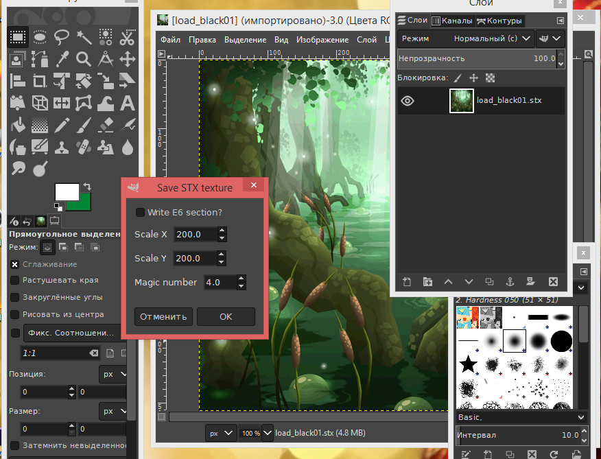

# STX plugin for GIMP

This plugin allows to load textures in `.stx` format. It's used, for example,
in Winx Club™ PC game (2006).

**This plugin is written for pre-2.10 API**

## BUILDING

The plugin is built with Meson. You also need to install `libgimp`. The other
dependencies should be installed along with it. Your pkg-config then
must include:

+ `gimp-2.0`
+ `gimpui-2.0`
+ `glib-2.0`
