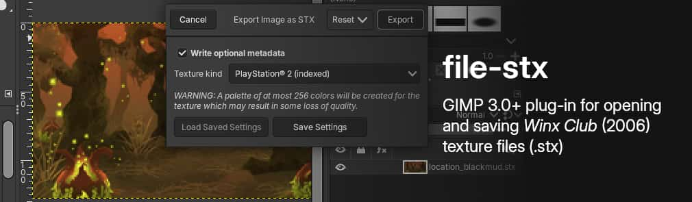

# file-stx

This plug-in for GIMP 3.0+ allows to open and export standalone `*.stx` textures
of the Sparkplug engine. It is used, for example, in *Winx Club* (2006) for
Windows and PlayStation® 2.

The support for PS2 textures is experimental at the moment.

## Installing

There are prebuilt distributions for Windows on the [Releases][releases] page.
Users of other operating systems are required to build the plug-in from the
source code (see below).

After you have downloaded the ZIP archive, extract its contents at the following
path:

- Windows: `%APPDATA%\GIMP\3.0\plug-ins`
- GNU/Linux: `~/.config/GIMP/3.0/plug-ins`
- macOS: `~/Library/Application Support/GIMP/3.0/plug-ins`

(If there are several folders under `GIMP`, select the one that matches your
current version. If there are no such paths, consult your GIMP folder settings
for the correct one.)

As a result, you should have a folder named `file-stx` under `plug-ins`.

## Building from sources

The project is built with the Meson build system. The core logic is implemented
in the [Splendete STX library][splendente] which also requires Zig 0.16+. See
its building instructions to acquire `${SPLENDENTE_PREFIX}`.

Also, the following libraries need to be available through `pkg-config` (refer
to your system package manager's software repositories for the corresponding
packages):

+ `gimp-3.0`, `gimpui-3.0` (usually provided with the GIMP package or GIMP
  SDK),
+ `imagequant`.

If building on Windows, you would need a MSYS2 CLANG64 environment.

When all the necessary tools and dependencies are installed, run the following
commands:

```shell
# ${SPLENDENTE_PREFIX} needs to be an absolute path
# On Windows, prefix needs to be C:/
meson setup _build -Dsplendente_prefix=${SPLENDENTE_PREFIX} -Dprefix=/
meson compile -C _build

# Instead of ${GIMP_PLUG_INS_FOLDER}, specify your GIMP plug-ins folder (see
# above)
DESTDIR=${GIMP_PLUG_INS_FOLDER} meson install -C _build
```

## Acknowledgements

1. This program links againts [libimagequant][], which is licensed under GPL
   version 3:

    ```
    libimagequant © 2009-2018 by Kornel Lesiński.
    © 1989, 1991 by Jef Poskanzer.
    © 1997, 2000, 2002 by Greg Roelofs.
    ```

2. This program adapts the (un)swizzling algorithm for PlayStation® 2 from
   the Python package [ReverseBox][] licensed under GPL version 3:

    ```
    Copyright © 2024-2025  Bartłomiej Duda
    ```

I would like to thank AnDi~SD for his extensive [research and
documentation][sparkplug-research] on the Sparkplug engine (including the
textures) that allowed to refine some earlier hypotheses. Also, huge thanks
to D:\Games\Winx, a Russian community of *Winx Club* video games, for their
valuable input throughout the development of this program.

[releases]:           https://github.com/kotwys/stx-gimp-plugin/releases
[splendente]:         https://github.com/kotwys/splendente
[libimagequant]:      https://pngquant.org/lib/
[ReverseBox]:         https://github.com/bartlomiejduda/ReverseBox
[sparkplug-research]: https://github.com/AnDi-SD/SparkplugEngineResearch
